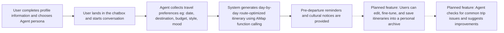
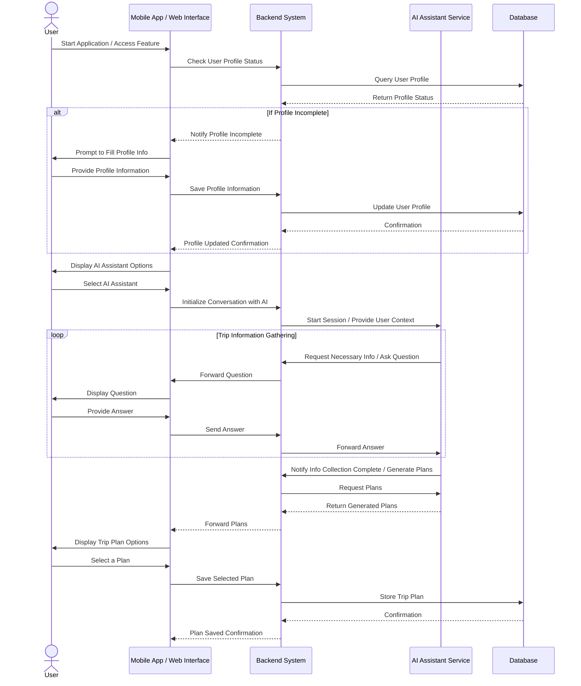

# 🧳 WanderPal | Your Personal Travel Companion Agent

**Companion-style Travel Chatbot · Intelligent Map-based Itinerary Planning**  
🌈 *More than just travel planning. We travel with you.*

---

## 📖 Table of Contents

- [✨ Project Overview](#-project-overview)
- [🚀 Key Features](#-key-features)
- [🛠️ Tech Stack](#-tech-stack)
- [📦 Getting Started](#-getting-started)
  - [Start Frontend](#start-frontend)
  - [Start Backend](#start-backend)
- [🔥 Core User Flow](#-core-user-flow)
- [🌟 Special Highlights](#-special-highlights)
- [🧭 Future Roadmap](#-future-roadmap)
- [🎬 Demo & Links](#-demo--links)
- [💖 Agent Personality](#-agent-personality)
- [🧑‍💻 Team](#-team)
- [📚 User Story Example](#-user-story-example)

---

## ✨ Project Overview

WanderPal is an AI-powered travel planning agent that combines emotionally intelligent dialogue with automated itinerary generation based on real-world map data (AMap function calling).

Our mission is to help users plan meaningful, personalized journeys — not just book trips, but feel understood while building flexible, optimized itineraries.

- 🤗 Companion-style conversations: Warm, dynamic, and friendly agent personalities adapt to your mood and travel goals.
- 🗺️ Smart route planning: Integrated with AMap function calling to automatically generate efficient travel routes and realistic daily plans.
- 🧠 Proactive trip validation: Allows user editing and detects unreasonable itineraries and gently advises improvements (to be developed).

---

## 🚀 Key Features

- 🎭 Personalized Agent Selection: Choose from 3 emotional modes — Gentle Care, Thoughtful Butler, or Bold Explorer.
- ✨ Companion-style Chat UX: Guided prompts to collect travel needs (time, destination, budget, mood, style).
- 🗺️ Smart Route Optimization: Automatically sequence daily routes with AMap function calling.
- 🛠️ Real-time Reasonability Checks: Validate opening hours, traffic time, route duplication, and over-scheduling.
- 📚 Pre-Departure Smart Reminders: Provide cultural tips, visa advice, and packing checklists.

---

## 💖 Agent Personality Overview

We offer three distinct Agent modes to cater to different user preferences for personalized travel planning:
- **Free Spirit (Healing & Gentle Companion)**
A warm and empathetic Agent that invites users to share their current mood and travel inspirations. Whether you’re seeking an escape from the hustle or a place for inner healing, this Agent will accompany you in designing a soft, thoughtful journey.
- **Personal Butler (Efficient & Detail-Oriented Planner)**
A professional and attentive Agent that focuses on fulfilling users’ practical travel needs. Whether it’s precise transportation arrangements or detailed budget planning, this Agent delivers highly efficient and personalized itineraries.
- **Inspiration Explorer (Adventurous & Bold Guide)**
A playful and daring Agent that helps users discover unique, off-the-beaten-path destinations. From transparent bubble houses by the forest to hidden cafés in abandoned trains, this Agent sparks spontaneous, exciting adventures tailored to your mood.

---

## 🛠️ Tech Stack

- Frontend: Node.js
- Backend: Python
- AI Engine: OpenAI GPT-4o
- Framework: Autogen
- Map Service: AMap function calling
- Deployment: Vercel

---

## 🔥 Core User Flow

1. User completes the profile information → chooses their preferred Agent persona.
2. User lands in the chatbox and starts a conversation with the chosen Agent.
3. The Agent collects travel preferences (date, destination, budget, style, mood).
4. System uses AMap function calling to generate a day-by-day route-optimized itinerary.
5. Pre-departure reminders and cultural notices are provided automatically.
6. *(Planned feature)* Users can edit, fine-tune, and save itineraries into a personal archive.
7. *(Planned feature)* Agent checks for common trip issues and gently suggests improvements.


---

## 🔥 System Design



---

## 🌟 Special Highlights

- Conversational soft guidance: Encouraging users to express vague or emotional needs and translating them into actionable plans.
- Real-time map validation: Using AMap function calling to plan routes and transportation.
- Emotional companion agent: Offers 3 different Agent personas, each with unique prompts.
- Smart pre-departure reminders: Auto-generated visa, packing, currency, and weather tips.

---

## 🧭 Future Roadmap

- Collaborative group itinerary planning
- Dynamic "inspiration cards" based on real-time mood detection
- Integration of hotel and restaurant recommendations via external APIs
- Memory feature: Retrieval-Augmented Generation (RAG) for better personalized planning
- Full multi-language support

---

## 🎬 Demo & Links

- **Youtube video**:
- **Live Demo**: [https://wanderpal.vercel.app/](https://wanderpal.vercel.app/)
- **Frontend Repository**: [https://github.com/amymacumc/WanderPal](https://github.com/amymacumc/WanderPal)
- **Backend Repository**: [https://github.com/amymacumc/WanderPal/tree/main/agent](https://github.com/amymacumc/WanderPal/tree/main/agent)

---

## 📦 Getting Started

### Start Frontend

```bash
git clone https://github.com/amymacumc/WanderPal.git
cd WanderPal
npm install
cd frontend
npm run dev
```

Open [http://localhost:3000](http://localhost:3000) to explore the application.

---

### config API keys
1.	Create a .env file in the agent directory:
```
API_KEY=XXX
MODEL=gpt-4o-mini
GAODE_API_KEY=XXX
AMAP_MAPS_API_KEY=XXX

```

2.	Create a .env.local file in the frontend directory:
```
NEXT_PUBLIC_AMAP_KEY=XXX
NEXT_PUBLIC_AMAP_SECURITY_CODE=XXX
```

## 🛠 Deployment
### Start Backend

```bash
cd agent
pip install -r requirements.txt
python main.py
```

---

## 🧑‍💻 Team

| Name | Email | Role | Responsibilities |
|:---|:---|:---|:---|
| Amy Ma (@amymacumc) | amyma2024@outlook.com | Project Manager / Product Manager | Product management, project planning, coordination, vision |
| Xia Zhong (@shinezhong) | shinezhong0626@gmail.com | UX / UI Designer | Figma design, user experience workflows |
| Keqin Ye (@quiet-river) | quietriver28@gmail.com | Frontend Developer | UI implementation, component logic |
| Junhao Ma (@huyonger) | hv-huyon@microsoft.com | Backend Developer | GPT integration, API services |

---

## 📚 User Story Example

### Emily’s “Gentle Escape” Urban Trip

**👩 Character Profile**

- Name: Emily
- Age: 29
- City: Manhattan, New York
- Occupation: Marketing Manager
- MBTI: INFP
- Travel Goals: Seeking a relaxing, emotionally healing short trip with budget control, real reviews, flexible planning.

---

### 🌐 Scenario: Emily Plans a Spring Getaway Using WanderPal’s Thoughtful Butler Agent

#### ✅ Step 1: Registration and Agent Selection

> "Good morning! I’m your personal travel concierge, WanderPal ☕ Welcome back. Let’s design a journey that’s gentle, personal, and made just for you."

#### ✅ Step 2: Collecting Core Travel Information

| Prompt | Emily’s Response | System Handling |
|:---|:---|:---|
| Travel Time | "Mid-May, about 5 days." | Date picker — May 12–17 |
| Destination | "Not decided yet." | Suggests Japan, California, South of France, Quebec, or Other |
| Budget | "Under $3000." | Sets budget range $2000–$3000 |
| Trip Style | "Culture, coffee shops, photogenic places." | Maps to "Cultural Exploration + Photo Spots" |
| Travel Intensity | "I want to sleep in." | Relaxed pace mode (max 8h/day) |
| Mood Status | "Burnt out… need a reset." | Triggers Gentle & Healing destination matching |
| Other Requirements | "Easy transportation, no complex transfers." | Prioritize transportation convenience |

---

#### ✅ Step 3: Generating Candidate Trip Cards

- Plan A: Tokyo Urban Healing Tour
- Plan B: California Art & Nature Getaway
- Plan C: Southern France Garden Tour

#### ✅ Step 4: Detailed Daily Schedule & Smart Suggestions

Each day’s plan includes:
- Interactive daily map view
- Transport (metro/walk/drive) with estimated costs
- Attraction tips (open hours, entrance fees, special notes)
- Clothing suggestions, cultural tips, weather alerts

#### ✅ Step 5: Saving and Feedback

User saves the itinerary and receives a warm confirmation.

> "Your itinerary has been saved to your archive 🌸 You can continue editing anytime — or invite friends to plan together!"

---

### ✅ Summary: How WanderPal Fulfilled Emily’s Needs

| User Need | WanderPal’s Response |
|:---|:---|
| Quickly generate viable plans | Companion-style onboarding + dynamic chatbox |
| Flexible trip pacing | Relaxed mode with daily limits |
| Budget transparency | Estimated costs preview |
| Real reviews | Crowd-sourced reviews and restrictions |
| Edit freedom | Add/remove attractions |
| Emotional support | Companion tone, mood recognition |
| Archive and collaboration | Saved trips, editable itineraries |

---
